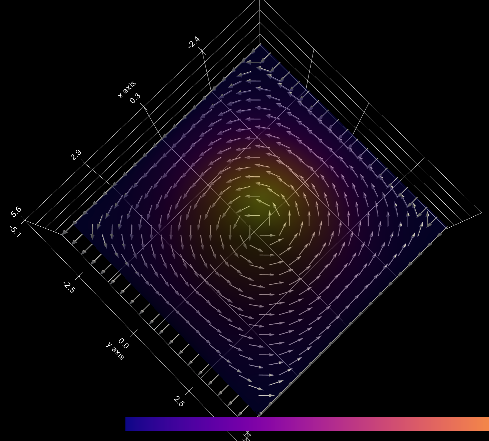
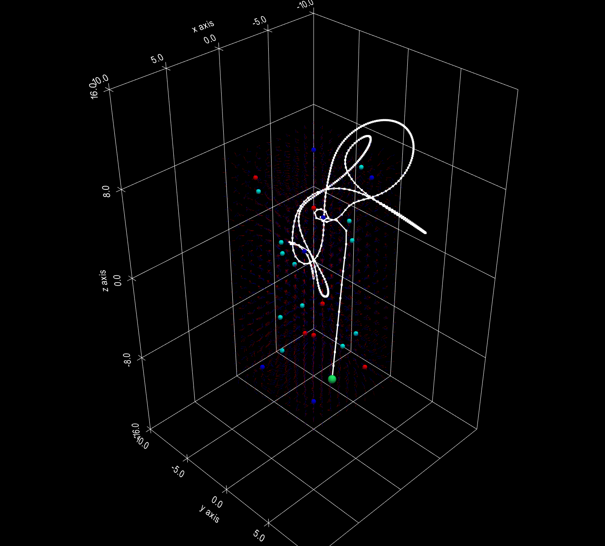

This Repo has some electricity and magnetism simulations! 

 
An image of the 2D magnetic field generated by a current surface J

 
An image of the trajectory of a particle in a field with 12 fixed charge dipoles and 12 fixed magnetic dipoles.
