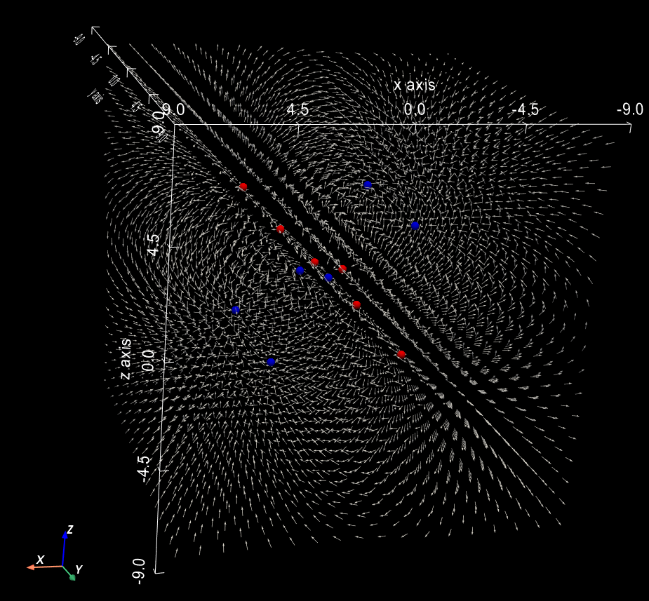
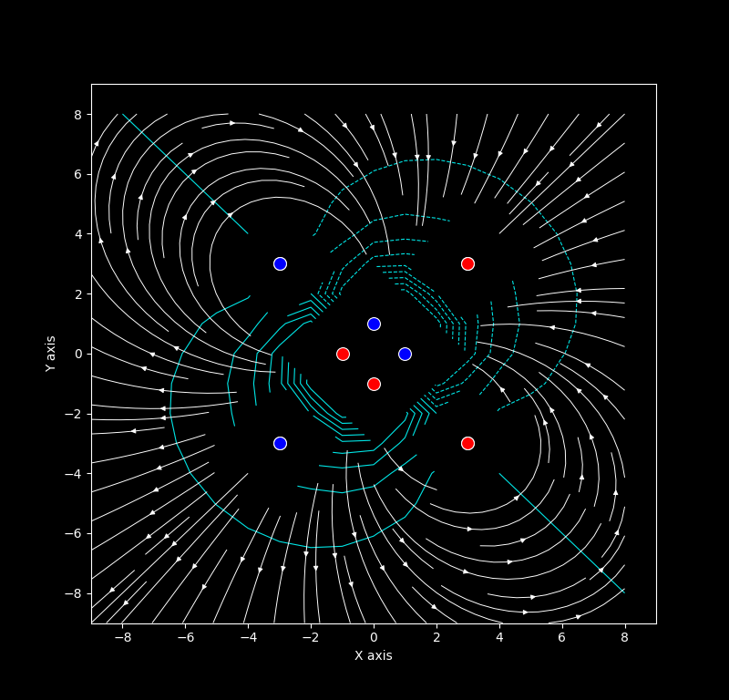
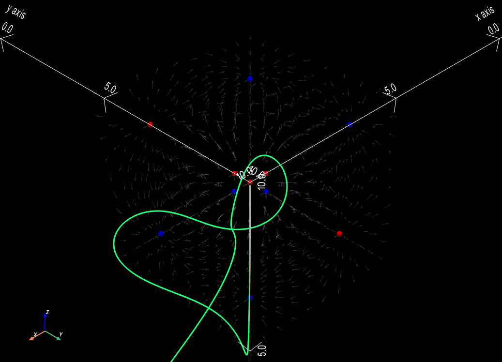
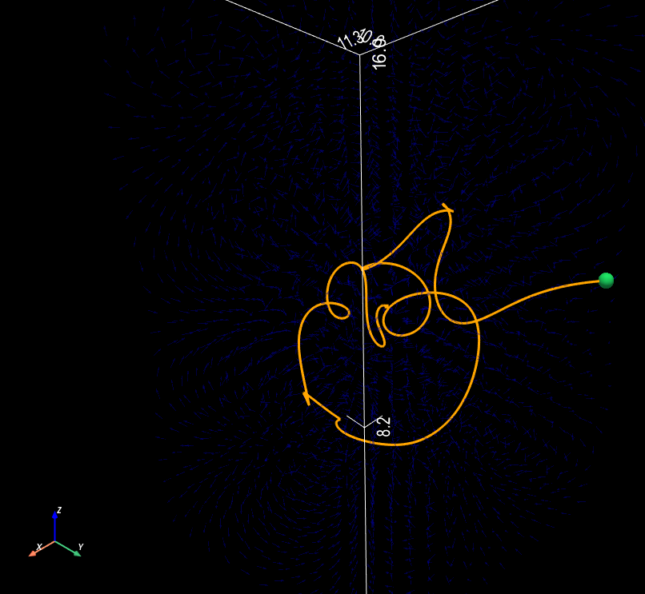
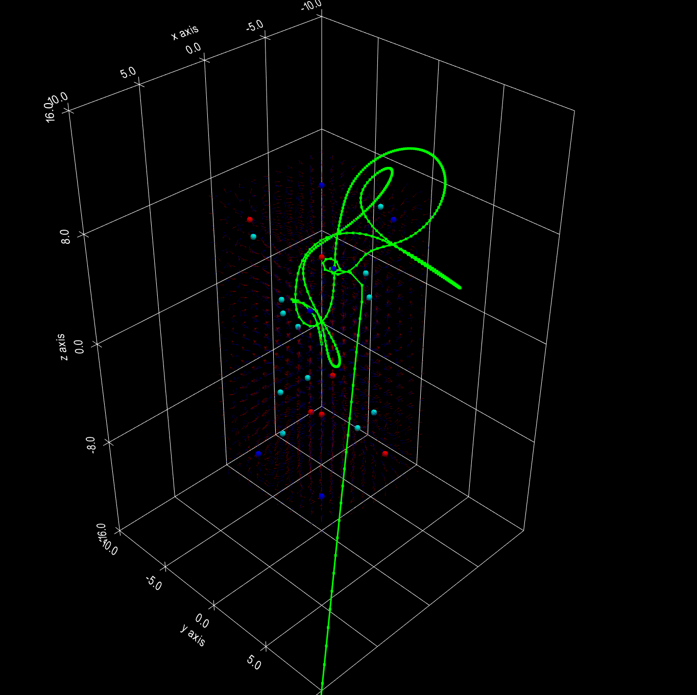
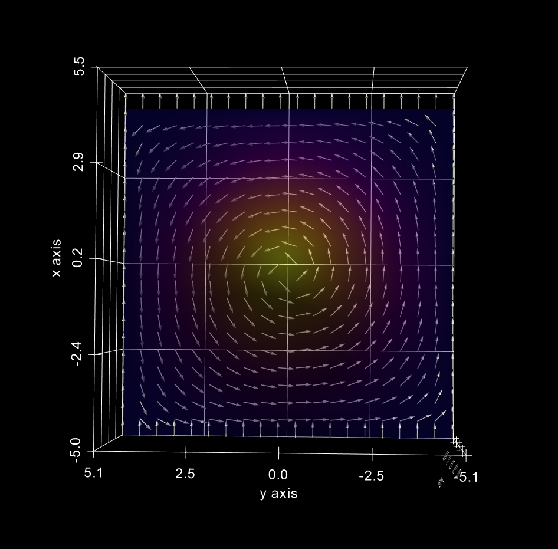

This Repo has some electricity and magnetism simulations!

# 1. Electric Fields and Potential

## 1.1 Electric Field

**1.1** uses **Coulomb's law** to generate an electric field using the equation

```math
\vec E_i = \frac{1}{4\pi \epsilon_0}\frac{q_i}{|r_i^2| }\hat r_i
```

Then using the principle of Superposition the vector fields can be added like this:

```math
\vec E_{total} = \sum_i \vec E_i
```

This gives us the visual:
<p align="center">

</p>
## 1.2 Electric Potential

**1.2** uses the **electric potential formula**

```math
V_i = \frac{1}{4\pi \epsilon_0}\frac{q_i}{|r_i| }
```

Again using the principle of Superposition we get the total potential at a point using scalar addition

```math
V_{total} = \sum_i V_i
```

The thing the visual should prove is the Electric-Field to Potential Relationship which is:

```math
\vec E_{total} = -\nabla V_{total}
```

Which we can see in the image below since the cyan lines (potential) are orthogonal to the electric field lines (white)<p align="center">
<p align="center">

</p>
## 1.3 Electric Field Motion

**1.3** uses Newton's 2nd law:

```math
\vec F_{net} = q_{dipole} \vec E_{total} = m_{dipole} \vec a_{dipole}
```

Solving this for acceleration gives us

```math
\vec a_{dipole} = \frac{q_{dipole} \vec E_{total}}{m_{dipole}}
```

In the code, I solve for the velocity using the RK4 method and update the position using the previous velocity. When plotted in 3D the dipole travels this path:
<p align="center">

</p>
# 2 Magnetic Fields and Electromagnetic Motion

## 2.1 Magnetic Field Motion

**2.1** uses magentic dipoles as the source of the fields, and an electric dipole as the dipole moving in the path. The equation of a magnetic field generated by a magnetic dipole is:

```math
\vec B_i = \frac{\mu_0}{4\pi}\frac{b_i}{|r|^3}\hat r
```

Again by the principle of superposition the fields can be added up like this:

```math
\vec B_{total} = \sum_i \vec B_i
```

Now the dipole moves in the field with the equation

```math
\vec a_{dipole} = \frac{q_{dipole}}{m_{dipole}}(v_{dipole} \times \vec B_{total})
```

This again was solved using RK4 which is shown in my code. In the image below, the dark blue lines are the magnetic field and the orange line is the trajectory of the electric dipole in this field. In this case the dipole eventually becomes extremely fast and leaves the field.
<p align="center">

</p>
## 2.2 Electromagnetic Motion

**2.2** has both electric dipoles creating a field as well as magnetic dipoles creating a field. The total force that the moving dipole experiences is:

```math
\vec F_{net} = q_{dipole}(\vec E_{total} + \vec v_{dipole} \times \vec B_{total})
```

This again can be used with Newton's 2nd law to get

```math
\vec a_{dipole} = \frac{q_{dipole}(\vec E_{total} + \vec v_{dipole} \times \vec B_{total})}{m_{dipole}}
```

Which will again be used to solve for velocity using RK4 methods that is shown in my code. The green trail again is the electric dipole moving in the electromagnetic field (red vector lines is for electric field while blue is for magnetic)
<p align="center">

</p>p>
# 3 Generating Magnetic Fields from Current Density

## 3.1: 1D Magnetic Field Generation

Section **3** uses **Ampere's law** under magnetostatic conditions which means the partial derivative of the electric field with respect to time is simply 0.

Ampere's law is represented by this equation:

```math
\vec \nabla \times \vec B = \mu_0 \vec J
```

Defining the magentic potential vector as:

```math
\vec \nabla \times \vec A = \vec B
```

We can use Poisson's equation which gives us:

```math
\vec \nabla^2 \vec A = -\mu_0 \vec J
```

Expanding the Laplacian we get:

```math
\frac{\partial ^2A}{\partial x^2} + \frac{\partial ^2A}{\partial y^2} + \frac{\partial ^2A}{\partial z^2} = -\mu_0 \vec J
```

The magnetic vector potential `A` is only defined on the `z`-axis with respect to `x` which gives us the normal differential equation:

```math
\frac{d^2A_z}{dx^2} = -\mu_0 J(x)
```

Using central differences I can discretize `A` like this:

```math
\frac{d^2 A_z}{dx^2} \approx \frac{u_{i+1}- 2u_{i} + u_{i-1}}{\Delta x^2}
```

Which will then be solved like this:

```math
u_{i+1}- 2u_{i} + u_{i-1}= -\mu_0 J \Delta x^2
```

And then using the Thomas Algorithm this tridiagonal system can be solved quickly with a time complexity of `\mathcal{O}(N)`.

The current distribution `J` is normally distributed with the following equation:

```math
J(x) = J_0 \exp\frac{(x-\frac{L}{2})^2}{2 \sigma^2}
```

After the magnetic vector potential is solved we compute the curl which give us

```math
B_y = \frac{-dA_z}{dx}
```

Which again was solved numerically using central differences:

```math
B_y = -\frac{A_z (x+\Delta x) - A_z(x-\Delta x)}{2\Delta x}
```

The entire **3.1** was written purely in **C++**

## 3.2: 2D Magnetic Field Generation

This part deals with the problem of

```math
\frac{\partial ^2A}{\partial x^2} + \frac{\partial ^2A}{\partial y^2} = -\mu_0 \vec J_z(x,y)
```

Using central differences again we get

```math
\frac{u_{i+1, j}- 2u_{i, j} + u_{i-1, j}}{\Delta x^2} + \frac{u_{i, j+1}- 2u_{i,j} + u_{i,j-1}}{\Delta y^2} = -\mu_0 \vec J_z(x,y)
```

The algorithm that I used: converting it into a 1D array using `k = iN + j` and converting it into a sparse matrix is all in my code. I then used scipy.linalg.spsolve in order to solve the system and then get the graph:
<p align="center">

</p>
This is what Ampere's law in school would normally look like (the right hand grip rule).
